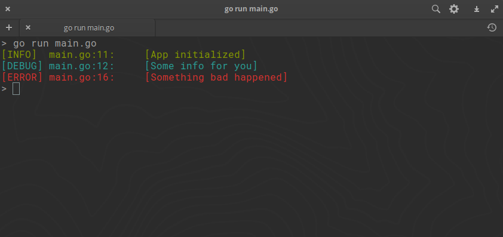

# Log

Simple colored logging for Go programs. No dependencies and under 40 lines of
code.

## Info

The package implements 3 loggers with Lshorfile set for easier debugging:

- log.Info - Color: green - Output: stdout
- log.Debug - Color: cyan - Output: stdout
- log.Error - Color: red - Output: stderr

## Example

```go
package main

import (
	"errors"
	"github.com/anastalaz/log"
)

func main() {
	log.Debugger = true

	log.Info("App initialized")
	log.Debug("Some info")

	err := errors.New("Something bad happened")
	if err != nil {
		log.Error(err)
	}
}
```


If log.Debugger is not set debug logs will not print

## License

MIT
